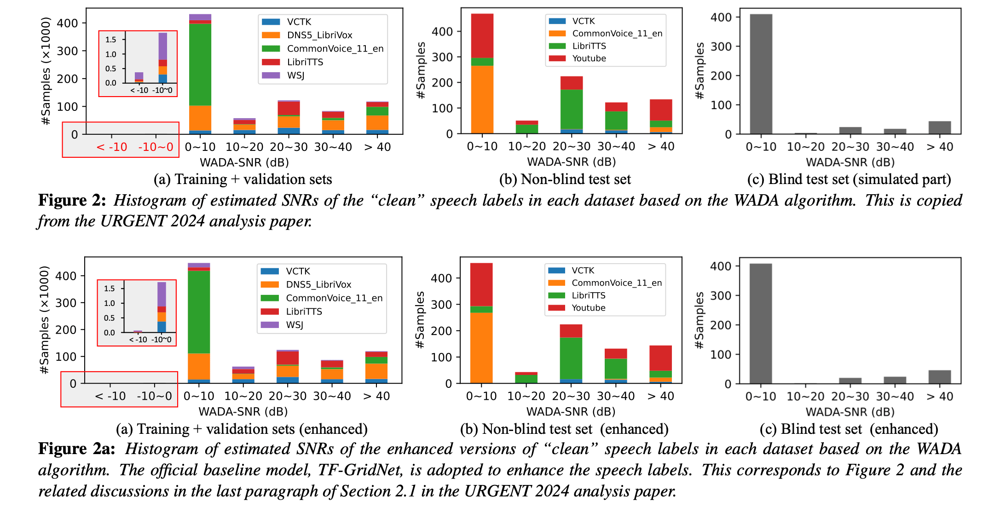
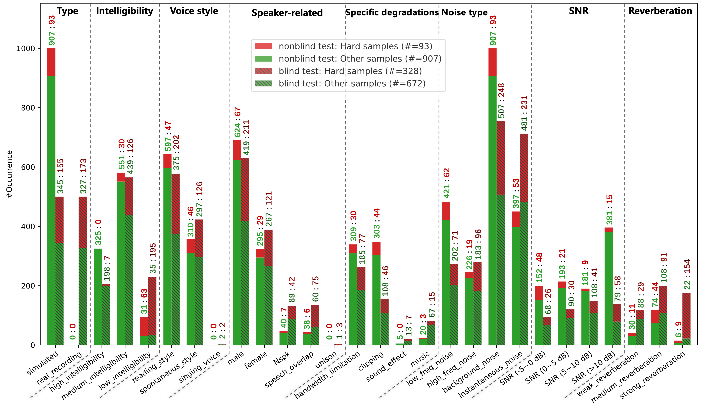
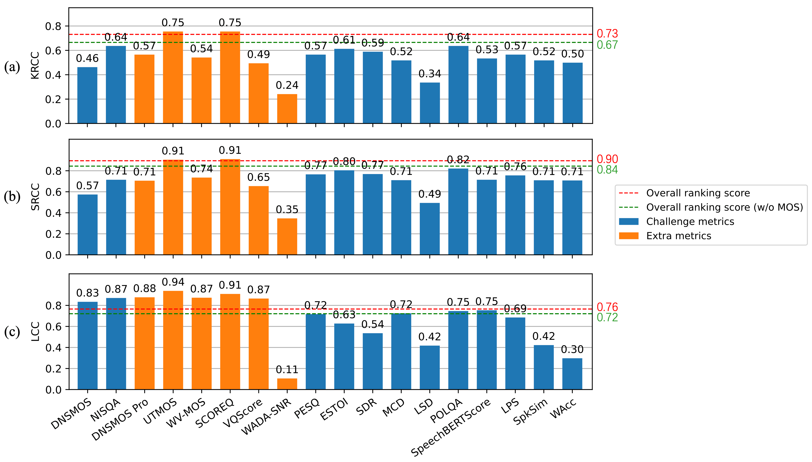

## Introduction

This is the official repository for the paper: [Lessons Learned from the URGENT 2024 Speech Enhancement Challenge](). We will refer to it as the **URGENT 2024 analysis paper** below for brevity.

### Table of Contents

- [WADA-SNR](#wada-snr)
- [Hard sample tagging](#hard-sample-tagging)
- [MOS correlation](#mos-correlation)
- [Citation](#citation)

### WADA-SNR

The [WADA-SNR algorithm](https://www.isca-archive.org/interspeech_2008/kim08e_interspeech.html) was adopted to roughly analyze the signal-to-noise ratio (SNR) distribution of the [datasets](https://huggingface.co/datasets/urgent-challenge/urgent2024_official) used in the URGENT 2024 Speech Enhancement Challenge. Our implementation of the WADA-SNR algorithm is provided at [wada_snr/calculate_wada_snr.py](wada_snr/calculate_wada_snr.py). The analysis results can be found below:



> [!TIP]
> We can observe that
> - The WADA-SNR distribution on each dataset almost remains the same before (Figure 2) and after (Figure 2a) applying the [baseline TF-GridNet model](https://huggingface.co/wyz/tfgridnet_for_urgent24) for enhancement. This indicates that the label noise issue (as discussed in Section 2.1 of the URGENT 2024 analysis paper) may still persist in the enhanced samples.


### Hard sample tagging

The tag occurrences of different samples in the [non-blind](https://huggingface.co/datasets/urgent-challenge/urgent2024_official) and [blind test](https://huggingface.co/datasets/urgent-challenge/urgent2024_official) sets can be found below:

> This is the enlarged version of Figure 3 in the URGENT 2024 analysis paper.
>
> For each tag (in the $x$-axis), there are two bars:
>   - the left one represents the number of occurrences of the tag in the non-blind test set,
>   - while the right one (hatched) represents the number of occurrences of the tag in the blind test set.
>
> The color of each bar, as well as the numbers (<span style="color:#519e3e;">num1</span> : <span style="color:#b02418;">num2</span>) above each bar, indicates the number of occurrences of the corresponding tag in other and hard samples, respectively.



The detailed definitions of the hard samples and tags can be found in [tagging/README.md](tagging/README.md).

### MOS correlation

We also calculated the correlation between the human-annotated Mean Opinion Scores (MOS) and different objective metrics on the blind test data. The objective metrics include:

> The <span style="color:#e97c36;">metrics in orange</span> (DNSMOS Pro, UTMOS, WV-MOS, SCOREQ, VQScore, and WADA-SNR) have not been used during the challenge. The rest are the metrics used officially in the challenge.

<table>
<thead>
<tr>
    <th>Category</th>
    <th>Metric</th>
    <th>Need Reference Signals?</th>
    <th>Supported Sampling Frequencies</th>
    <th>Value Range</th>
    <th>Run on CPU or GPU?</th>
</tr>
</thead>
<tbody>
<tr>
    <td rowspan="8">Non-intrusive SE metrics</td>
    <td><a href="https://github.com/urgent-challenge/urgent2024_challenge/blob/main/evaluation_metrics/calculate_nonintrusive_dnsmos.py">DNSMOS</a> ↑</td>
    <td>❌</td>
    <td>16 kHz</td>
    <td>[1, 5]</td>
    <td>CPU or GPU</td>
</tr>
<tr>
    <td><a href="https://github.com/urgent-challenge/urgent2024_challenge/blob/main/evaluation_metrics/calculate_nonintrusive_nisqa.py">NISQA</a> ↑</td>
    <td><span style="font-weight:400;font-style:normal;text-decoration:none">❌</span></td>
    <td>48 kHz</td>
    <td>[1, 5]</td>
    <td>CPU or GPU</td>
</tr>
<tr>
    <td><a href="mos/calculate_nonintrusive_dnsmos_pro.py" style="color:#e97c36;">DNSMOS Pro</a> ↑</td>
    <td><span style="font-weight:400;font-style:normal;text-decoration:none">❌</span></td>
    <td>16 kHz</td>
    <td>[1, 5]</td>
    <td>CPU or GPU</td>
</tr>
<tr>
    <td><a href="mos/calculate_nonintrusive_mos.py" style="color:#e97c36;">UTMOS</a> ↑</td>
    <td><span style="font-weight:400;font-style:normal;text-decoration:none">❌</span></td>
    <td>16 kHz</td>
    <td>[1, 5]</td>
    <td>CPU or GPU</td>
</tr>
<tr>
    <td><a href="mos/calculate_nonintrusive_mos.py" style="color:#e97c36;">WV-MOS</a> ↑</td>
    <td><span style="font-weight:400;font-style:normal;text-decoration:none">❌</span></td>
    <td>16 kHz</td>
    <td>[1, 5]</td>
    <td>CPU or GPU</td>
</tr>
<tr>
    <td><a href="mos/calculate_nonintrusive_scoreq.py" style="color:#e97c36;">SCOREQ</a> ↑</td>
    <td><span style="font-weight:400;font-style:normal;text-decoration:none">❌</span></td>
    <td>16 kHz</td>
    <td>[1, 5]</td>
    <td>CPU or GPU</td>
</tr>
<tr>
    <td><a href="mos/calculate_nonintrusive_vqscore.py" style="color:#e97c36;">VQScore</a> ↑</td>
    <td><span style="font-weight:400;font-style:normal;text-decoration:none">❌</span></td>
    <td>16 kHz</td>
    <td>[-1, 1]</td>
    <td>CPU or GPU</td>
</tr>
<tr>
    <td><a href="wada_snr/calculate_wada_snr.py" style="color:#e97c36;">WADA-SNR</a> ↑</td>
    <td><span style="font-weight:400;font-style:normal;text-decoration:none">❌</span></td>
    <td>Any</td>
    <td>[-20, 100]</td>
    <td>CPU</td>
</tr>
<tr>
    <td rowspan="6">Intrusive SE metrics</td>
    <td><a href="https://github.com/urgent-challenge/urgent2024_challenge/blob/main/evaluation_metrics/calculate_intrusive_se_metrics.py">PESQ</a> ↑</td>
    <td>✔</td>
    <td><span style="font-weight:400;font-style:normal;text-decoration:none">{8, 16} kHz</span></td>
    <td><span style="font-weight:400;font-style:normal;text-decoration:none">[-0.5, 4.5]</span></td>
    <td>CPU</td>
</tr>
<tr>
    <td><a href="https://github.com/urgent-challenge/urgent2024_challenge/blob/main/evaluation_metrics/calculate_intrusive_se_metrics.py">ESTOI</a> ↑</td>
    <td>✔</td>
    <td><span style="font-weight:400;font-style:normal;text-decoration:none">10 kHz</span></td>
    <td>[0, 1]</td>
    <td>CPU</td>
</tr>
<tr>
    <td><a href="https://github.com/urgent-challenge/urgent2024_challenge/blob/main/evaluation_metrics/calculate_intrusive_se_metrics.py">SDR</a> ↑</td>
    <td>✔</td>
    <td>Any</td>
    <td>(-∞, +∞)</td>
    <td>CPU</td>
</tr>
<tr>
    <td><a href="https://github.com/urgent-challenge/urgent2024_challenge/blob/main/evaluation_metrics/calculate_intrusive_se_metrics.py">MCD</a> ↓</td>
    <td>✔</td>
    <td>Any</td>
    <td>[0, +∞)</td>
    <td>CPU</td>
</tr>
<tr>
    <td><a href="https://github.com/urgent-challenge/urgent2024_challenge/blob/main/evaluation_metrics/calculate_intrusive_se_metrics.py">LSD</a> ↓</td>
    <td>✔</td>
    <td>Any</td>
    <td>[0, +∞)</td>
    <td>CPU</td>
</tr>
<tr>
    <td><a href="http://www.polqa.info">POLQA</a> ↑</td>
    <td>✔</td>
    <td><span style="font-weight:400;font-style:normal;text-decoration:none">8~48 kHz</span></td>
    <td><span style="font-weight:400;font-style:normal;text-decoration:none">[1, 5]</span></td>
    <td>CPU (proprietary GUI program)</td>
</tr>
<tr>
    <td rowspan="2">Downstream-task-independent metrics</td>
    <td nowrap><a href="https://github.com/urgent-challenge/urgent2024_challenge/blob/main/evaluation_metrics/calculate_speechbert_score.py">SpeechBERTScore</a> ↑</td>
    <td>✔</td>
    <td>16 kHz</td>
    <td>[-1, 1]</td>
    <td>CPU or GPU</td>
</tr>
<tr>
    <td><a href="https://github.com/urgent-challenge/urgent2024_challenge/blob/main/evaluation_metrics/calculate_phoneme_similarity.py">Levenshtein phone similarity (LPS)</a> ↑</td>
    <td>✔</td>
    <td>16 kHz</td>
    <td><span style="font-weight:400;font-style:normal;text-decoration:none">(-∞, 1]</span></td>
    <td>CPU or GPU</td>
</tr>
<tr>
    <td rowspan="2">Downstream-task-dependent metrics</td>
    <td><a href="https://github.com/urgent-challenge/urgent2024_challenge/blob/main/evaluation_metrics/calculate_speaker_similarity.py">SpkSim</a> ↑</td>
    <td>✔</td>
    <td>16 kHz</td>
    <td>[-1, 1]</td>
    <td>CPU or GPU</td>
</tr>
<tr>
    <td><a href="https://github.com/urgent-challenge/urgent2024_challenge/blob/main/evaluation_metrics/calculate_wer.py">WAcc</a> (=1-WER) ↑</td>
    <td>❌</td>
    <td>16 kHz</td>
    <td>(-∞, 1]</td>
    <td>CPU or GPU</td>
</tr>
</tbody>
</table>


The MOS labels for each original/enhanced speech sample in the blind test set are released at [https://huggingface.co/datasets/urgent-challenge/urgent2024_mos](https://huggingface.co/datasets/urgent-challenge/urgent2024_mos).
The correlations between MOS and different objective metrics in the blind test data are shown below:

> This is the refined version of Figure 4 in the URGENT 2024 analysis paper, with two major changes:
>
> 1. A new correlation measure, the Spearman's rank correlation coefficient (SRCC), is added.
> 2. The overall ranking score calculated based solely on objective metrics (those colored in <span style="color:#2e67d3;">blue</span>) is added, denoted as<br/>[<span style="color:#377e22;">---- </span><span style="color:black;">Overall ranking score (w/o MOS)</span>]() in the figure.



> [!TIP]
> We can observe that
> 1. Both <u>Overall ranking score (w/o MOS)</u> and <u>Overall ranking score</u> are highly correlated with the human-annotated MOS, **outperforming** all individual objective metrics officially used in the challenge **in terms of KRCC and SRCC**. This highlights the importance and effectiveness of the comprehensive [evaluation protocol design](https://urgent-challenge.github.io/urgent2024/rules/) in the challenge.
> 2. Several non-intrusive metrics that have not been specifically designed for the universal speech enhancement task (also unused in the challenge), such as <u>UTMOS</u> and <u>SCOREQ</u>, also show very strong correlations with the human-annotated MOS, indicating their potential for future SE research.

### Citation

If you find this repository useful, please consider citing our paper:

```bibtex

```
